# Flow-JEPA

Flow-JEPA is an action-conditioned world model that predicts future visual
representations with flow matching. It learns directly from image and action
sequences, predicts an entire latent trajectory jointly, and supplies a latent
goal cost for model-predictive control (MPC). Compared with LeWM, Flow-JEPA
improves planning performance under clean conditions and achieves substantially
stronger performance under noisy conditions.

The repository contains the Flow-JEPA model, training entry point, and clean or
Gaussian-noise evaluation for Two-Room, Reacher, Push-T, and OGBench-Cube.

<table>
  <tbody>
    <tr>
      <th scope="row">Two-Room</th>
      <td align="center" valign="top">
        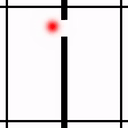<br>
        <strong>Dataset</strong>
      </td>
      <td align="center" valign="top">
        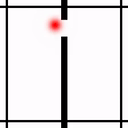<br>
        <strong>LeWM</strong>
      </td>
      <td align="center" valign="top">
        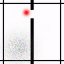<br>
        <strong>Ours</strong>
      </td>
    </tr>
    <tr>
      <th scope="row">Reacher</th>
      <td align="center" valign="top">
        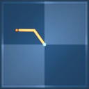<br>
        <strong>Dataset</strong>
      </td>
      <td align="center" valign="top">
        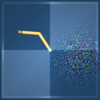<br>
        <strong>LeWM</strong>
      </td>
      <td align="center" valign="top">
        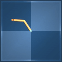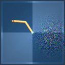<br>
        <strong>Ours</strong>
      </td>
    </tr>
    <tr>
      <th scope="row">Push-T</th>
      <td align="center" valign="top">
        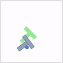<br>
        <strong>Dataset</strong>
      </td>
      <td align="center" valign="top">
        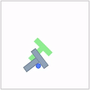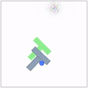<br>
        <strong>LeWM</strong>
      </td>
      <td align="center" valign="top">
        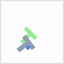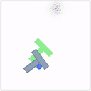<br>
        <strong>Ours</strong>
      </td>
    </tr>
    <tr>
      <th scope="row">OGBench-Cube</th>
      <td align="center" valign="top">
        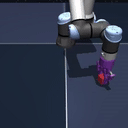<br>
        <strong>Dataset</strong>
      </td>
      <td align="center" valign="top">
        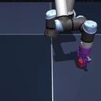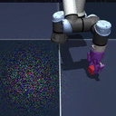<br>
        <strong>LeWM</strong>
      </td>
      <td align="center" valign="top">
        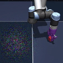<br>
        <strong>Ours</strong>
      </td>
    </tr>
  </tbody>
</table>

## Installation

Flow-JEPA uses the same software environment and datasets as
[LeWM](https://github.com/lucas-maes/le-wm). Create a Python environment and
install the training, environment, and HDF5 dependencies with:

```bash
uv venv --python=3.10
source .venv/bin/activate
uv pip install "stable-worldmodel[train,env,format]"
```

## Data and storage

Flow-JEPA uses the same HDF5 datasets as LeWM. Download the
data from the
[Hugging Face dataset collection](https://huggingface.co/collections/quentinll/lewm)
and extract each archive with:

```bash
tar --zstd -xvf archive.tar.zst
```

Set a storage directory explicitly:

```bash
export STABLEWM_HOME=/path/to/stable-wm
export LOCAL_DATASET_DIR="$STABLEWM_HOME"
mkdir -p "$STABLEWM_HOME/datasets"
```

Place the HDF5 datasets under `$STABLEWM_HOME/datasets/`:

| Task | Training configuration | Dataset file |
|---|---|---|
| Two-Room | `data=tworoom` | `tworoom.h5` |
| Reacher | `data=dmc` | `reacher.h5` |
| Push-T | `data=pusht` | `pusht_expert_train.h5` |
| OGBench-Cube | `data=ogb` | `cube_single_expert.h5` |

## Training

Training is configured with Hydra under `config/train/`. For example:

```bash
python train.py data=pusht \
    output_model_name=flow-jepa-pusht
```

The default flow source is standard Gaussian noise. The implementation also
supports a noisy-current source:

```bash
python train.py data=pusht \
    output_model_name=flow-jepa-pusht \
    flow_matching.source=noisy_current \
    flow_matching.source_noise_scale=0.5
```

To initialize the visual encoder and projector from an existing checkpoint and
freeze them:

```bash
python train.py data=pusht \
    output_model_name=flow-jepa-pusht \
    pretrained_visual_encoder.enabled=true \
    pretrained_visual_encoder.checkpoint=/path/to/checkpoint \
    pretrained_visual_encoder.freeze=true
```

Set `pretrained_visual_encoder.freeze=false` to use the checkpoint only as
initialization.

Weights & Biases logging is disabled by default. Enable it with:

```bash
python train.py data=pusht \
    output_model_name=flow-jepa-pusht \
    wandb.enabled=true \
    wandb.config.entity=YOUR_ENTITY \
    wandb.config.project=flow-jepa
```

## Evaluation

Evaluation uses CEM by default. A checkpoint can be specified as either a
folder containing one `.pt` file and `config.json`, or as an explicit `.pt`
file beside its `config.json`.

```bash
python eval.py --config-name=pusht \
    policy="$STABLEWM_HOME/checkpoints/flow-jepa-pusht/weights_epoch_20.pt"
```

Use the matching evaluation configuration for each task:

| Task | Evaluation option |
|---|---|
| Two-Room | `--config-name=tworoom` |
| Reacher | `--config-name=reacher` |
| Push-T | `--config-name=pusht` |
| OGBench-Cube | `--config-name=cube` |

### Gaussian visual perturbation

Clean evaluation is the default. Enable the pixel-space Gaussian perturbation
with:

```bash
python eval.py --config-name=pusht \
    policy=/path/to/weights.pt \
    perturbation.enabled=true
```

One Gaussian patch is sampled per environment and applied consistently to both
the current observation and goal image. Configure its standard deviation,
radius, and placement directly:

```bash
python eval.py --config-name=pusht \
    policy=/path/to/weights.pt \
    perturbation.enabled=true \
    perturbation.gaussian_noise.std=100.0 \
    perturbation.gaussian_noise.radius=35 \
    perturbation.gaussian_noise.center=random_non_agent
```

This visual perturbation is distinct from the Gaussian latent source used by
flow matching.

## Loading a checkpoint in Python

```python
import stable_worldmodel as swm

model = swm.wm.utils.load_pretrained("/path/to/weights.pt")
model = model.cuda().eval()
model.requires_grad_(False)
model.set_flow_seed(42)
```

Checkpoint loading is configuration-driven: the architecture is instantiated
from the adjacent `config.json`, then the state dictionary is loaded strictly.

## Repository structure

```text
jepa.py           Flow construction, integration, rollout, and planning cost
module.py         Flow predictor, attention blocks, encoders, and SIGReg
train.py          Dataset transforms, objective, optimization, and checkpoints
eval.py           MPC evaluation in clean or Gaussian-noise environments
perturbations/    Gaussian image perturbation used during evaluation
config/train/     Hydra training configurations
config/eval/      Task, planner, and evaluation configurations
```

## Acknowledgements

This repository builds on the code and experimental infrastructure of
[LeWM](https://github.com/lucas-maes/le-wm). We thank its authors for making
their implementation, environments, datasets, and evaluation framework
publicly available.
